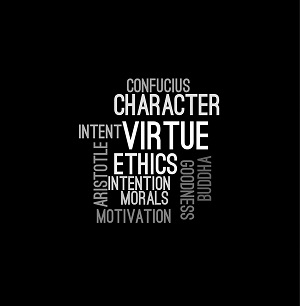

## Enforcing Ethics Education
  Ethics is a ruleset, decisions, and actions of a person. As a software engineer they are expected, as professionals, to work in the benefit of others.
  Professionals earn and gain the respect of others through their hard work, but also by their actions. Ethics is much more complex
  then deciding what is right and what is wrong. A sense of self morals is also incorporated into ethics. Every person has their own
  "ethics ruleset" that they abide by, but many aren't aware of how their rules were created. I believe that ethics is a responsibility
  of an individual to provide what they believe is right for others. Working in the interest of others does not always lead you to the correct 
  path, and that is the sole reason why self morals are important to incorporate into ethics. Understanding what forms your choices is 
  what helps progress your views on your ideals and also evolves your code of ethics.
  
## Coding Contrition
  In the article "The code I'm still ashamed of" Sourour discusses his experience with regretting code that he had written.
  Many of us, when we were younger were always told to listen to authorities and do as we are told. This way of instructing the youth
  inhibits self-thinking, and creating one's own moral compass. This is comparable to the Milgram experiment in which people continued
  shocking patients despite the high risk of injury or death because an authoritative figure had told them to. This was portrayed 
  through his article when he stated "I had a job to do, and I did it". Sourour had not yet realized the importance of having his own
  ethics.
  
  

  
  His firm had sold out to large pharmaceutical companies and he was tasked to create a seemingly general quiz that ultimately recommends
  their partner's products unless they were allergic or already taking it. This scummy practice was a loophole for the big pharma 
  companies. Sourour was unaware of the side effects of the drug that his quiz has recommended. Unfortunately he learned it through
  a news report where a young girl had tragically passed through the use of the drug that was recommended in the quiz he had created. 
  In the article he speaks about his own naivety: "Nothing that we were doing was illegal" tells me that he had initially seen
  an underlying wrong in what he was doing. While being deceitful helps rake in cash, it goes against the betterment of others.
  It isn't fair to the consumer, has harmful consequences, and consumers lose trust when companies put money as their highest priority.
  As a result, Sourour was able to look back at his actions and was able to grow from this incident. His progress and story 
  have a strong message to future professionals, that ethics play a large role in your career; ignorance and naivety can create 
  immense consequences.
  
## My Take

Although Sourour was naive to the situation he was in, I don't believe he was at fault. The fault lies solely on the company 
he worked at, as well as the partnering pharma companies. Pharmaceutical companies are a large issue in America even today, 
with inflation of crucial drug prices, as well as other ridiculous medical costs. Everyone in the Milgram experiment went pass
the fatal zone of shocking during their participation and I believe most people would have done the same. Even his account 
manager who also originally questioned the quiz, was quick to comply after Sourour explained the requirements
needed for the quiz. Hindsight and experiences like Sourour's article helps people grow and understand the consequences, 
whether it's from the code we right or any other day to day action. Knowing what he had been through, I would distance myself
from projects in which questions or goes against my ethics, and my moral beliefs.
Through examination of Sourour's story we can see the unethical nature and consequences of being deceitful to others, as well as applying one's
own ethics when seeing something questionable.