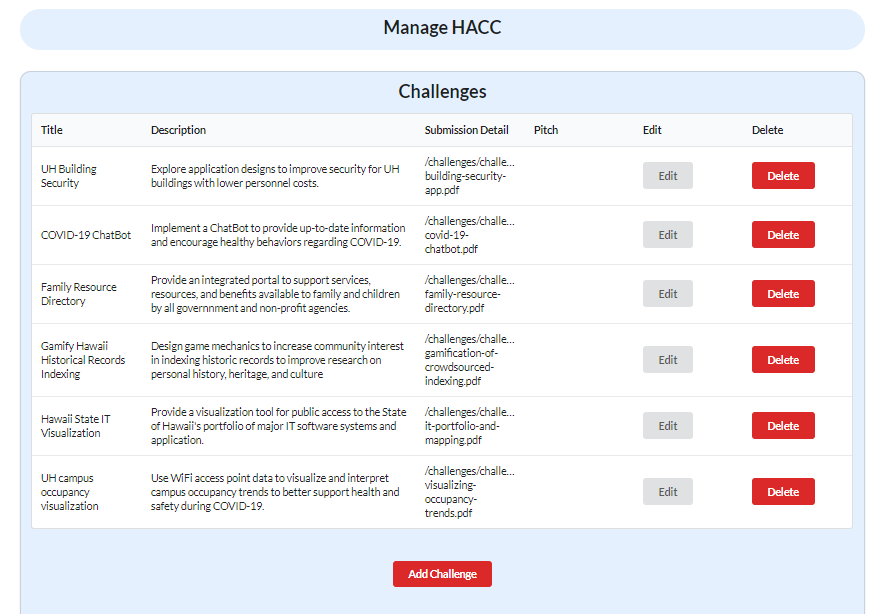
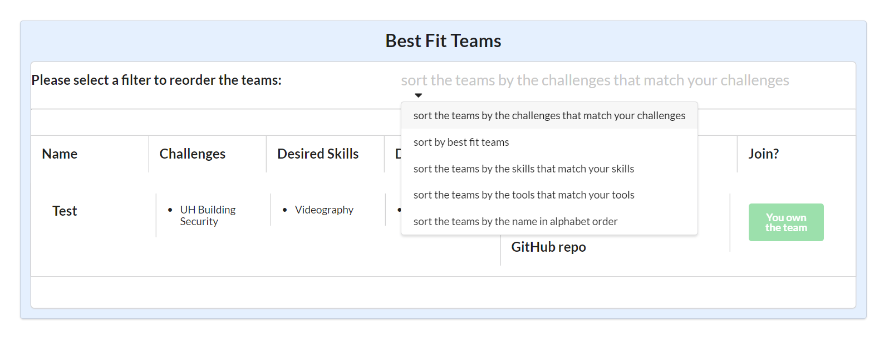
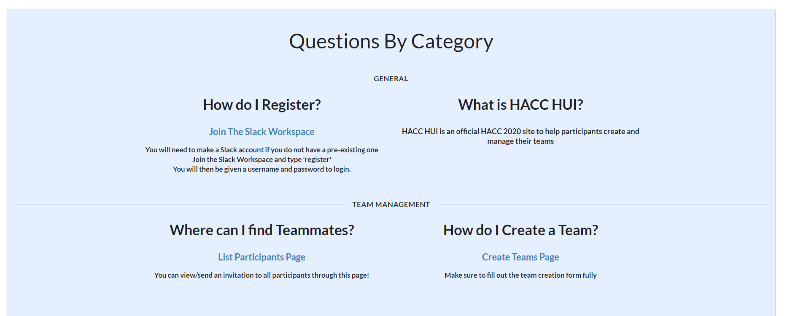

## What is HACC-Hui?
  Hacc-Hui is a project we created to assist people in the HACC by helping individuals find teams and vice versa. Our Hacc-Hui website is connected 
  through an application called Slack, using a slackbot to communicate between the workspace and application. Users can sign up to the website through 
  the slackbot as well as receiving messages regarding team management whether it’s an invitation or a request to join. When they first login to the 
  website they are required to read through and accept a consent form. For participants of the HACC that are under 18 they are required to provide their 
  parent’s email address in which the parents can sign for their child. There are two groups, users and admins. Users can fill out a profile and create or 
  look for a team. There are also functionalities for teams such as dming team members, leaving a team, suggestions for tools and skills, and even filter 
  through participants. As an admin you had the ability to view all the teams, view all the participants, edit information about the teams, as well as edit 
  topics such as tools or challenges.

## My Milestone Functionality
  The project was originally split up into 4 milestones. For the first milestone I was tasked to configure HACC. A page was to be created for admin use 
  in which a list of challenges, skills, and tools are shown. The lists can be edited, a new option added, or delete and option. This issue was worked on 
  by me and my team member Angeli. To configure the challenges, tools and skills you had to route to the database that held these respective tools and fetch 
  them respectively, creating an administrator component which would be pulled through by the administrator page.

  
Here on this page you can view, add, edit, or delete challenges, skill or tools. 

  
  [Github Page](https://github.com/HACC-Hui/HACC-Hui/blob/master/app/imports/ui/components/administrator/ManageHaccWidget.jsx). 
  
  
 For the second milestone I was tasked to work on creating a team finder page which showcases all the created teams, as well as the functionality to 
  sort through the list of teams by challenges, skills or tools. The best fit team page pulls from the a component widget that lists all the teams. The 
  functionality of sorting through these teams was however pulled from another group. The general functionality of the sorting was done through retrieving 
  all the developers from each team, finding all the teams through a team ID, and having an intersection through the teams topic ID (challenges, tools and 
  skills) respective to the list of topics. 

  

  
  
This page lists all the teams and you can sort them by topic. (Alphabetical and best fit was added later on) 
 
  
  [Github Page](https://github.com/HACC-Hui/HACC-Hui/blob/13e7deffacc550fc2e76e31d7521bdbb8b15f32f/app/imports/ui/pages/participant/BestFitTeamDisplay.jsx). 

  
  The final milestone was a combination of milestones 3 and 4. The issues I worked on included working on a view team/team compliance page for an 
  administrative account with a team member, and frontend ui in which I improved the look and feel across all the pages. We created a function that would 
  look through all participants and check whether or not they fulfill the “isComplaint” requirement from the participant collection. Then we created 
  functions that acted upon that information, and showcases either “Team is compliant” or “Team is not compliant”. Compliance is shown when you first 
  create an account, and if a member has not accepted it, or a participant who is under 18 and have not had their parents accept it on their behalf, every 
  team they are on is in non compliance. For the overall page to showcase the teams, we mapped through the teams, their challenges, members, info, and an 
  edit button to edit info about the team. As for the look of the website, I changed the help page to be more compact, made pages fit an overall theme of 
  the website by making all pages the same color, the same style of div, padding, navbar, and backgrounds.

  

  
  
Here you can view all the teams that have been created and whether or not the team is compliant. 

  
  [Github Page](https://github.com/HACC-Hui/HACC-Hui/blob/89ccd14720339b4a1b4d967fe1f1055c20df558d/app/imports/ui/components/administrator/ViewTeamExampleWidget.jsx).

  

  
  
 Help page became more like other pages and fit two questions per row instead of one. 

  
  [Github Page](https://github.com/HACC-Hui/HACC-Hui/blob/1cad17530c15c5bf31d4b93d1bf5ae32ee4d5e9c/app/imports/ui/pages/HelpPage.jsx). 

  
  ## Teamwork makes the dreamwork
  
When the project initially began, the class was split into groups of 4-5, my group being five. For the first two milestones there were four stories to work on. As a result, I worked alongside a team member for milestone 1, and another classmate for the final sprint of the project. As a team we first decided how we were going to split up the issues to do. We did it by a first come first serve. We would all read what all the issues would need and then right after class we would put down which issue we wanted in the chat. We never encountered any conflicts when it came to deciding on our issues.
  
Working on our first milestone, I was working with another team member on one issue. We decided that we would work on the same issue individually and pull directly what we got from done. Everything was smooth as we updated each other on the progress of our work. We created a page that had the functionality to configure the topics of the Hacc through an administrative page. As we continued to work on the project, my group member was able to get ahead with some of the functionality and guided me through what she had done, and as we completed the page we also tidied up the look of the page.

For the second milestone, I was tasked on working on creating a page where you can view teams and also filter through the teams through topics. This milestone I worked on my own and I had run into some issues of my own with certain functionalities with filtering. As a team we help each other by asking questions and replying to each other, or otherwise we ask our teacher for help. Whenever we run through an error we check each other’s code and provide advice. I was able to learn a lot through asking my team members and while my filtering functionality was not completely working I was able to get aspects of my milestone finished quicker than if I was otherwise alone. 

For the last milestone I worked with another person and this time we talked through suggestions to get the functionalities of our issue completed. Our issue was getting the team compliance for an admin page. We had initially run into an error but as we tried a few things, we were able to overcome this obstacle, and delete the lines of code that were interfering with our page. We worked together to create a function that checked the compliance of members within a team and then we also worked together to create a function that showcased the compliance based on that result. Another issue that I had worked on was sending an email through a slackbot based on if a participant was underage, and I worked on this slackbot functionality but there was some miscommunication as my professor had already finished creating the functionality part of the issue. The last issue was the front end look of the website in which I worked on alone. On this issue I communicated with my professor on what he wanted the website to look like, and I worked on the website based on his suggestions. Our professor was like another person in each group and was there if we ever ran into trouble.
	
## The Takeaway
Hacc-Hui is the biggest project I have worked on so far as a student. Coming into this project I understood the pace and demand this project requires. What I did not expect was how big the difference between ICS 314 and 414 was. In ICS 314 we learned the basics and were given a template for our final project to build upon. While 414 was also building off a given repository, in 314 we were required to recreate the template in steps so we could fully understand how it worked. This classwork was also new, and our professor was experiencing this type of class for the first time as well. We ran into issues with merging our projects as well, the time crunch of the milestones, and the errors that occurred from the base code. As we started the project I realized that I should have prepared myself more by going through all the files and understanding the functionalities. Furthermore, I did not go in for help as much as I should have in the earlier stages of the project. This resulted in my milestone 2 not having all the functionalities that were asked of the issue, as well as getting behind my group member in milestone 1. As I began to ask more questions from both the class and the teacher I was able to get through my issues a lot easier. People who ran into similar roadblocks or encountered the same errors would provide their tips or solutions. I even found myself helping others with their problems in the chat. I learned that it is way easier to get help on an issue than trying to figure it out on my own. As a result of this, the issues I worked on my final milestone, although around the same difficulty, I was able to finish significantly quicker. The takeaways were the importance of communication, preparedness, and the understanding of the issues that can come up in a large group project. 

