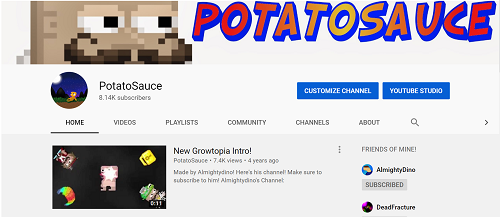

## Viral
Ever since I first started playing computer games, and gaming content became popular I always wanted to put something online of my own. So I started a YT channel when I was in middle school playing a small building/creation type of game. It had a small following but a dedicated community. I was introduced to this game from another mobile game and I got hooked on it for a long time. The game itself was very simple as you created items by mixing other items, and then building much like a 2d minecraft. I decided that I would make some tutorials on YouTube. 

Although I believe my content creation was quite amateur and somewhat cringeworthy, I was able to gain experience in video editing through programs such as Camtasia and windows Movie Maker which albeit were not very great editing programs. I also got familiar with recording software such as OBS, and thumbnail or art created through the use of paint.net. I don't believe that I made exceptional content, but after a few popular videos I was able to get a small following, reaching to nearly ten thousand subscribers and getting a total view count of around 1,200,000.

## Encore

  A large reason why I left YouTube despite a reasonably growing fan-base was due to work conditions. Using Windows Movie Maker, and without the possession of a microphone made it extremely hard to quality check my content. I was also starting to despise the game due to money grabbing updates and terrible community. I quit the game mentally, before I quit creating YouTube videos. As I continued during my inactivity, I watched as channels with smaller watchtime grow and grow. The last time I had checked, there were multiple of Growtopia Youtubers well over 100,000 subscribers, but I have no regrets in my departure as I could not tolerate the game any longer. In the past year, a friend of mine started his own YouTube channel, and a request of a collaboration inspired me to start uploading videos again. I now have a better editing software, along with a decent microphone, and most importantly a game that I love playing; CSGO. It's time to go viral.
  
Link to my YouTube Channel: <a href="https://www.youtube.com/channel/UCsZ0NPu6mz6qdya0Rtc8RBQ"></i>Youtube</a>
